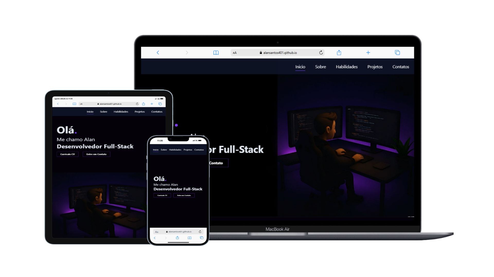

# Portfilio

👋 Olá, eu sou Alan dos Santos
Sou desenvolvedor Front-end e Full Stack em formação, apaixonado por transformar ideias em soluções digitais funcionais, intuitivas e visualmente atrativas.

🚀 Tenho experiência prática em projetos com React.js, TypeScript, JavaScript, HTML, CSS, Tailwind, Node.js e Firebase, além de integração com APIs e automações com ferramentas como n8n.

🎯 Ao longo da minha jornada, venho desenvolvendo projetos reais que envolvem desde jogos interativos até plataformas completas de estudo, gestão financeira, previsão do tempo, controle de pedidos e muito mais — tudo com foco em responsividade, usabilidade e desempenho.

💻 Meu portfólio é o reflexo da minha evolução constante e da minha vontade de aprender, criar e contribuir com soluções modernas e bem construídas.

## 🚀 Como Acessar
Abra o <a href="https://alansantos401.github.io/Portfolio/" target="_blank" rel="noopener noreferrer">Portfolio</a> no navegador e divirta-se!

## 📁 Tecnologias
- HTML
- CSS
- JavaScript

---
